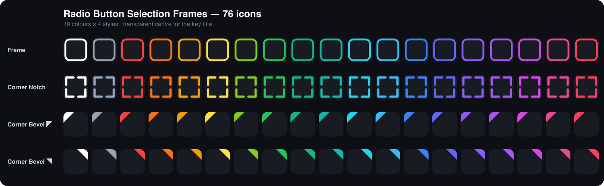
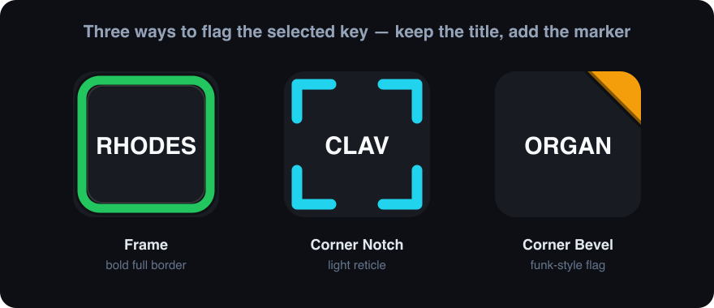

# Radio Button Selection Frames

**76 transparent-centre overlay icons that mark which Stream Deck key is the active one in a radio-button group.**



Stream Deck lets you put a text **title** on a key, but it has no built-in way
to say *"this option is currently selected"*. Keep the plain title, then set one
of these icons as the key's **selected / pressed** state image:



## What's in the pack

| | |
|---|---|
| **Icons** | **76** — 19 colours × 4 styles |
| **Styles** | Selected Frame · Selected Corner Notch · Selected Corner Bevel (Left) · (Right) |
| **Colours** | white, slate, red, orange, amber, yellow, lime, green, emerald, teal, cyan, sky, blue, indigo, violet, purple, fuchsia, pink, rose |
| **Format** | 144 × 144 PNG, **transparent centre** so the white key title keeps full contrast |
| **Licence** | **CC-BY-4.0** — free to use, share and adapt, including commercially, with credit ([license.txt](license.txt)) |

## Install

The `.streamDeckIconPack` is **not committed** — it is reproducible build output.
Build it, then double-click the result:

```sh
bin/build.sh   # → dist/com.beennnn.radioframes.streamDeckIconPack
```

Stream Deck installs it into the icon library; pick a frame from any key's icon
picker. (The individual 144 × 144 PNGs in [`icons/`](icons/) are committed too,
if you only want one.)

---

## The four styles

- **Selected Frame** — a bold rounded border hugging the key edge. Loudest
  signal; best when the whole panel is one radio group.
- **Selected Corner Notch** — four L-shaped corner brackets, centre clear.
  Subtler; a light reticle around the title.
- **Selected Corner Bevel (Left / Right)** — a single chamfered top corner
  (a coloured "dog-ear") with a dark liseré on the diagonal. Left and right
  variants so two groups can share one panel (e.g. one group blue on the left,
  another yellow on the right).

Every stroke sits on a dark halo, so a frame stays visible on light key
backgrounds as well as black ones.

## How to use it as a radio button

These are the **state 1 (selected)** image. State 0 (idle) = no frame, just the
plain title. Drive the swap with a multi-state MIDI action bound to an
**exclusive group** so pressing one key clears the frame on all the others.

With the Trevligaspel *MIDI* plugin (`se.trevligaspel.midi`, or any plugin
exposing the same state script), the radio logic is three lines — `@radio:1` is
the exclusive group id shared by every key in the group:

```text
[(@radio:1){state:0}]          # another key in group "radio:1" was pressed → go idle (no frame)
[(release){state:1}]           # on release stay selected (keep the frame)
[(press){state:1}{@radio:1}]   # on press → selected (show frame) AND claim group radio:1 (clears the others)
```

Give each key the same `@radio:1` group; only one key holds state 1 at a time.
Use a different group id (`@radio:2`, …) per independent set of keys. Add a
`{cc:CH,CC,VAL}` to the `press` line if the key should also send MIDI when it
becomes the selected one.

*(The plugin is third-party and not affiliated with this pack.)*

## Build from source

```sh
python3 gen_frames.py   # regenerate src/*.svg + tags.json (edit COLOURS/geometry first)
bin/build.sh            # render → validate → contact sheet → package
```

`src/*.svg`, the rendered `icons/` and `tags.json` are committed so the pack is
reproducible; `dist/`, `contact-sheet.png` and `maker-media/` are gitignored.

Built with the [sdicons](https://github.com/Beennnn/streamdeck-toolkit) toolkit
(cloned as `../streamdeck-toolkit`, or set `$SDICONS`). Requires `rsvg-convert`
(`brew install librsvg`) + Pillow.

## License

Icons **CC-BY-4.0** — see [license.txt](license.txt). Generator/tooling MIT.
